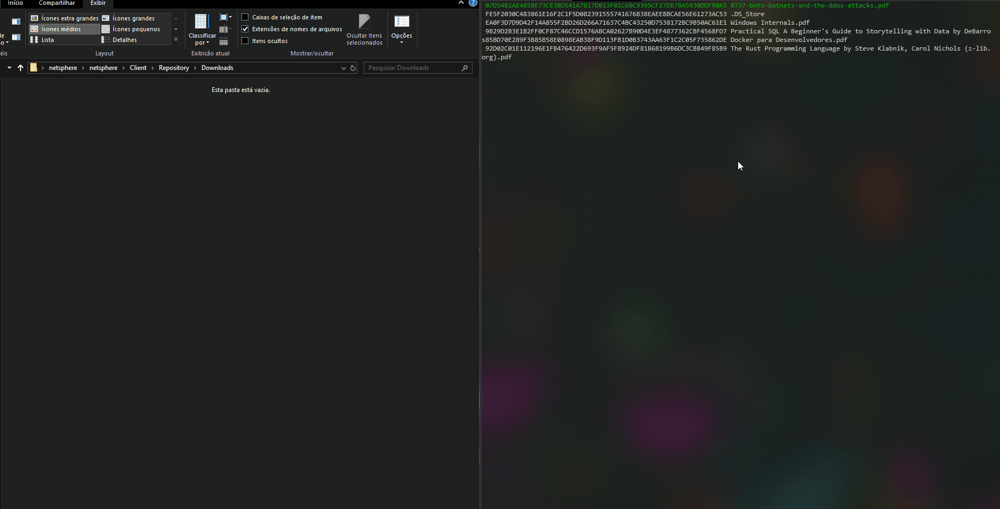

# Netsphere

## Build
Run the below command in both Server and Client folder
```
dotnet build
```

## Run
- Create a folder called 'Repository' and place every file you would like to share into it

## Demonstration
On first run, NetsphereClient will synchronize your repository folder with NetsphereServer

Demonstration of one peer requesting files to another peer, which is located in a MacOS system.

